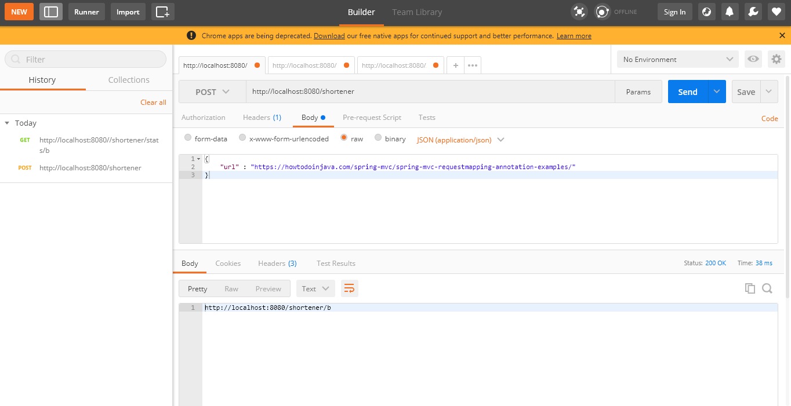
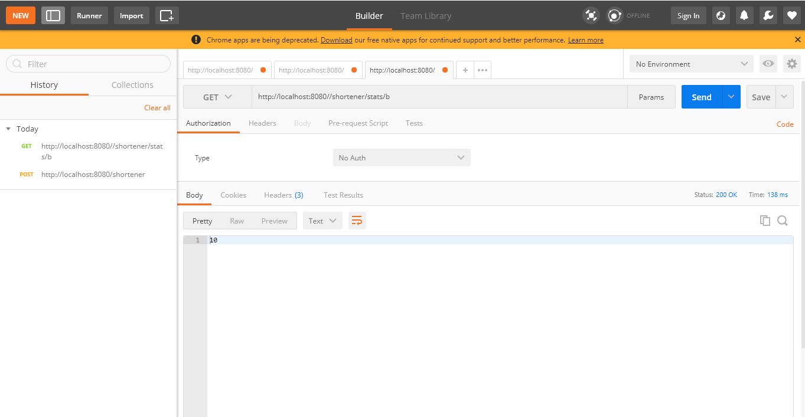

# urlshortener
REST API which implements short URL creation and also supports forwarding of short URL to original long URL

There are 3 API's (2 API's for shortening and redirection and 1 API for getting URL redirection stat info) designed this application :-
1) shortenUrl
2) redirectUrl

# How shortening works?
shortenUrl will take a long URL and return it's short URL.It first validates if the input URL sent by the user is a valid URL or not based on https://www.ietf.org/rfc/rfc2396.txt. It then retrieves the local URL from the HttpServletRequest and passes it to urlShortnerService. In service layer it checks if it is an existing URL, if so then it returns the same url to the user and does not create a new one. In case it is a new long url to be shortened, it then goes to the repository layer, increments generated ID which gets saved as a field value pair. With field as this ID and value as Long URL. This ID, a long value performs a base10 to base 62 conversion then by converting each individual digits into corresponding character which creates a uniqueid. This uniqueid is then used to create the shortened url by appened it's value to the local url.

# Sample request :-
{
	"url" : "https://howtodoinjava.com/spring-mvc/spring-mvc-requestmapping-annotation-examples/"
}

# REST Endpoint (POST Request)
http://localhost:8080/shortener

# How redirection works?
redirectUrl takes this unqiueID and passes it on to the service layer. In the service layer it convertes this uniqueID string to a list of characters, which then performs base62 to base 10 conversion and fetches it's corresponding ID (which was saved as field value during shortening). This is ID is then passed to repository layer which gets original long URL stored and user is redirected to it. Additionally a stats service is also called which saves an increment value as to how many times this short URL has been redirected.

# Sample Request :-
Just type the short URL in browser for instance http://localhost:8080/shortener/b

# How URL stats info works?
fetchURLStat takes this unqiueID and passes it on to the service layer and further to repository layer which fetches the counter value for the short URL being redirected.

# Sample request :-
NA

# REST Endpoint (GET Request)
http://localhost:8080//shortener/stats/b

